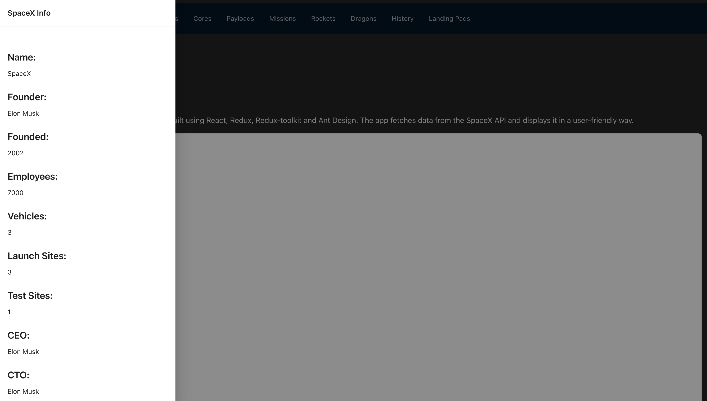

# React NASA API


A hobby application to test UI components of Ant design. For data it uses open API exposed from SpaceX.

### Features

- **SpaceX API Integration**: Fetches data from SpaceX's public APIs.
- **Responsive Design**: Ensures the app looks good on all devices.
- **State Management**: Utilizes Redux and Redux Toolkit for state management.
- **UI Components**: Built with Ant Design for a sleek and modern interface.
- **Fast Development**: Uses Vite for a fast and optimized development experience.
- **Linting and Formatting**: Integrated ESLint for code quality and consistency.

### Prerequisites

Make sure you have the following installed:

- [Node.js](https://nodejs.org/) (version 14 or higher)
- [npm](https://www.npmjs.com/) or [yarn](https://yarnpkg.com/)

### Screenshots

Here are some screenshots of the application:




### Installation

1. Clone the repository:

    ```sh
    git clone https://github.com/apfirebolt/react_nasa_api.git
    cd react_nasa_api
    ```

2. Install the dependencies:

    ```sh
    npm install
    # or
    yarn install
    ```

### Running the Development Server

To start the development server, run:

```sh
npm run dev
# or
yarn dev
```

This will start the Vite development server and you can view the application by navigating to `http://localhost:3000` in your browser.

### Building for Production

To create a production build, run:

```sh
npm run build
# or
yarn build
```

This will bundle the application into static files for production.

### Linting

To lint the project, run:

```sh
npm run lint
# or
yarn lint
```

### Project Structure

```plaintext
react_nasa_api/
├── public/             # Static assets
├── src/                # Source files
│   ├── assets/         # Assets like images, styles, etc.
│   ├── components/     # React components
│   ├── pages/          # Page components
│   ├── App.jsx         # Main App component
│   ├── main.jsx        # Entry point
├── .eslintrc.js        # ESLint configuration
├── vite.config.js      # Vite configuration
├── package.json        # Project metadata and dependencies
└── README.md           # Project documentation
```

### Contributing

Contributions are welcome! Please open an issue or submit a pull request.

### License

This project is licensed under the MIT License. See the [LICENSE](LICENSE) file for details.

### Acknowledgements

- [NASA API](https://api.nasa.gov/) for providing the data
- [React](https://reactjs.org/) for the UI library
- [Vite](https://vitejs.dev/) for the build tool
- [ESLint](https://eslint.org/) for the linting tool

### Contact

If you have any questions, feel free to reach out at [aspper20@gmail.com](mailto:aspper20@gmail.com).